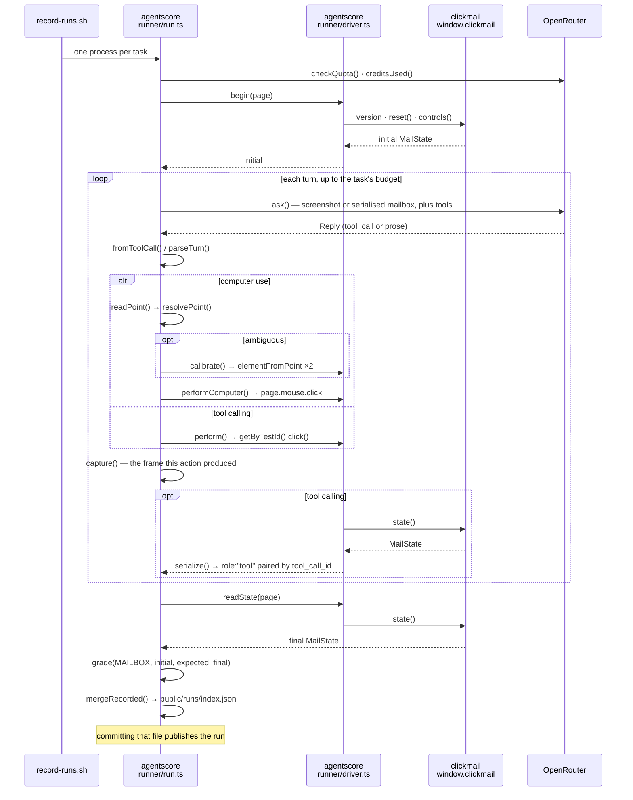

# The execution cycle

What actually runs, in call order, and which repository owns each step.

The plain-words version is
[How one run works](../README.md#how-one-run-works-in-plain-words) in the
README. This is the same story at the level of files and functions.

## Who owns what

Three repositories, and the boundary between them is the point rather than an
accident.

| repo | owns | knows about the others |
|---|---|---|
| **clickmail** | the world: mail, folders, search, labels, the DOM | nothing. No tasks, no grading, no models |
| **agentscore** | tasks, the model loop, the driver, grading, the console | drives clickmail over HTTP through a published contract |
| **polyact** | one action schema and token accounting across providers | nothing |

The only thing clickmail exposes to a harness is three methods on
`window.clickmail`. It cannot be told what world to start in, only asked to
reset to its own — because a driver that could write the world could write the
answer.

There are **two** execution cycles in agentscore, and they share almost no code:

1. **The browser run** — TypeScript, `web/runner/`, a real Chromium against
   clickmail. This is what the console shows.
2. **The instruction-following suite** — Python, `src/agentscore/`, text tasks
   against free models. No browser.

They are described separately below because they answer different questions and
their numbers are never combined.

---

# 1. The browser run

One OS process per task. `web/record-runs.sh` spawns
`node --experimental-strip-types runner/run.ts` once per task, so a spent
budget or an exhausted quota has to survive the exit — which is why the budget
lives in a file rather than in memory.

`run.ts` has no `main()`. The bootstrap is top-level module code at the bottom
of the file; `runTask()` is the unit of work.

## Phase 0 — before anything is spent

| # | call | what it does |
|---|---|---|
| 1 | `run.ts` module scope | validates `--mode` and `--task` against `TASKS` **before** touching the network. A typo used to spend a batch on the wrong action space |
| 2 | `run.ts › checkQuota()` | `GET openrouter.ai/api/v1/auth/key`. 401 → stop, 429 → stop |
| 3 | `lib/models.ts › isPaidModel()` | decided from the catalogue, not from a `:free` suffix in the name |
| 4 | `run.ts › creditsUsed()` | the provider's own spend figure, read before and compared after |
| 5 | `run.ts › readBudgetState()` | the baseline written by the first invocation of the session |
| 6 | `run.ts › chainFor(mode)` → `lib/models.ts › freeModels()` | the ordered list of models to try |

Then, per task: `runTask(taskId, stamp, mode, chain)`.

## Phase 1 — open the world and photograph it

```
runTask()
  ├─ lib/harness/tasks.ts › taskById()          the task
  ├─ lib/harness/tasks.ts › turnsFor()          its turn budget for this space
  ├─ playwright › chromium.launch()
  │    └─ browser.newContext({ viewport })      fresh storage per task
  ├─ page.goto(GYM_URL?run=<id>)
  ├─ runner/driver.ts › begin(page)
  │    ├─ driver.ts › contract(page)
  │    │    ├─ page.waitForFunction(() => window.clickmail)
  │    │    └─ reads window.clickmail.version, compares to AUTOMATION_VERSION
  │    ├─ page.evaluate(() => window.clickmail.reset())
  │    │    └─ CLICKMAIL lib/mail/automation.ts › install() › reset()
  │    │         └─ seedState() → write() → hydrate(deep clone)
  │    │            returns MailState — the initial snapshot
  │    └─ page.evaluate(() => window.clickmail.controls())
  │         └─ CLICKMAIL controls(): every [data-testid] on the page,
  │            checked against REQUIRED_CONTROLS so a renamed control
  │            fails here rather than mid-run
  └─ run.ts › capture()                         page.screenshot() → 00-start.jpg
```

`begin()` returns the world **the application says it is in**. The harness never
installs a mailbox, which is what makes the pair of snapshots a verdict is
computed from both come from the application.

## Phase 2 — the turn loop

`for (let turn = 1; turn <= maxTurns; turn++)`. The two action spaces differ in
exactly two places: what goes into the request, and how the action is carried
out. Everything between is shared.

### 2a. Build the request

| space | system prompt | user content | tools |
|---|---|---|---|
| computer use | `lib/environment/computer.ts › computerPrompt(VIEWPORT)` | task prompt + short text history + `image_url` data URL of the current frame | `computer.ts › computerToolSchemas()` |
| tool calling | `lib/environment/serialize.ts › SYSTEM_PROMPT` | full transcript; the first user turn carries `driver.ts › observe(page)` | `lib/environment/catalog.ts › toolSchemas()` |

`observe()` is `readState()` → `serialize()` — the mailbox as text. Computer use
never sees it; tool calling never sees a screenshot.

### 2b. Ask the model

```
run.ts › ask(outgoing, mode, chain, tools)
  └─ fetch POST openrouter.ai/api/v1/chat/completions
       body: { model, messages, temperature: 0, max_tokens,
               tools, tool_choice: "auto",
               provider: PAID ? AFFORDABLE : FREE_ONLY }   ← lib/models.ts
```

`ask()` walks the model chain and retries inside each model. `FREE_ONLY` is a
price ceiling of zero the provider enforces by refusing rather than billing — a
guard on the other side of the network, not one this code could get wrong.

Returns `Reply { content, toolCall, reasoning, usage, cost, model, latencyMs }`.

### 2c. Read the reply

```
reply.toolCall ? lib/agent/parse.ts › fromToolCall()   transport: "tool_call"
               : lib/agent/parse.ts › parseTurn()      transport: "prose"
```

A model with tools that answers in prose anyway is still a measurement of that
model, so the reply is read rather than discarded — but which way it arrived is
recorded on the entry, because "it did the task" and "it did the task without
ever calling a tool" are different findings.

### 2d. Resolve the coordinate — computer use only

This is the part most likely to make a good model look bad, so it is three
tiers, in order of authority:

```
1. computer.ts › declaredConvention(reply.model)
      turn 1 only, keyed on the model that actually answered.
      A prior, not a verdict.

2. computer.ts › readPoint(action.args)
      accepts x/y, coordinate: [x,y], point, start_coordinate,
      and string spellings like "412, 233" — Anthropic never sends
      named x and y, so a schema offering only those asks that family
      to answer in a dialect it was not trained in.

   computer.ts › resolvePoint(x, y, VIEWPORT, pinned?)   → the point in use
   computer.ts › resolvePoint(raw.x, raw.y, VIEWPORT)    → the same numbers with
                                                           nothing assumed
      If the second is *decisive* and disagrees with what is pinned, the
      coordinate wins over the declaration.

3. driver.ts › calibrate(page, primary, alternate)
      Only when nothing is declared and the numbers are ambiguous.
      Two driver.ts › targetAt() calls → page.evaluate(document.elementFromPoint).
      Whichever reading lands on a control settles it. No model call, no token.
```

Settled once per run and then pinned: a convention belongs to the model, not to
an individual number.

### 2e. Carry it out

```
computer use:  driver.ts › performComputer(page, action, point)
                 → page.mouse.click / page.keyboard.type / page.mouse.wheel
                 → driver.ts › targetAt() records what was under the point

tool calling:  driver.ts › perform(page, action)
                 → page.getByTestId(id).click({ timeout: 4000 })
```

Both drive the same real page through Chromium's real input. A click that lands
on nothing is still performed — a person can do that, and recording it as
attempted-and-missed is more useful than refusing.

### 2f. Close the loop

```
page.waitForTimeout(180)        Chromium repaints asynchronously
run.ts › capture()              the frame this action produced
entries.push({ entry_type: "action", screenshotBefore, screenshot, metadata })
```

`screenshotBefore` is the previous turn's file by reference — the frame the
model was actually looking at when it decided. One screenshot per action made a
run unreadable: an archive click shows an empty reading pane, which is the
correct result and looks exactly like a click that hit nothing.

Then the result goes back:

- **tool calling** — `observe(page)` again, pushed as `role: "assistant"` with
  the verbatim `tool_calls`, then `role: "tool"` paired by `tool_call_id`. The
  protocol pairs an outcome to the call that caused it; delivering it as a user
  message asks the model to infer that from position.
- **computer use** — one line appended to `history`, and next turn's screenshot.

### 2g. How the loop ends

| condition | `status` |
|---|---|
| the model calls `finish` | `completed` |
| three consecutive turns with no action | `no_action` |
| `turn === maxTurns` | `max_turns` |
| anything throws | `infrastructure_error` — **unscored**, dropped from the denominator |

`max_turns` is still graded. Three of the 48 published runs spent their whole
budget and passed anyway.

## Phase 3 — grade the pair, not the route

```
driver.ts › readState(page)                     → final: MailState
run.ts › capture(..., "zz-final")

lib/harness/grade.ts › grade(MAILBOX, initial, task.expected(initial), final)
  ├─ lib/environment/describe.ts › MAILBOX      what counts as a change
  │     volatile:         ids, receivedAt, selectedId, query
  │     incidentalSuffix: ".read" — looking before acting is neither
  │                       required nor a mistake
  ├─ lib/harness/tasks.ts › task.expected(initial) → the golden state,
  │     built by applying the task's own mutation to the world the
  │     environment reported. Not a fixture.
  ├─ grade.ts › diff(env, seed, golden)     → required changes
  ├─ grade.ts › diff(env, seed, submitted)  → actual changes
  └─ missing = required not in actual;  extra = actual not in required
```

| missing | extra | status |
|---|---|---|
| — | — | `pass` |
| yes | — | `incomplete` |
| — | yes | `overreach` |
| yes | yes | `both` |

The route is never graded. There are many correct ways to archive an email and a
shorter one is not a failure.

## Phase 4 — write it down, and publish by committing

```
runTask() returns RunRecord { entries, snapshots: { initial, final }, verdict, … }

run.ts module scope
  ├─ runs.filter(status !== "infrastructure_error")   nothing scored ⇒ nothing written
  ├─ lib/harness/runs.ts › mergeRecorded(before, fresh)   --append; keyed on
  │     task + action space + model, so re-recording one task replaces its own
  │     earlier result and leaves every other alone
  ├─ run.ts › pruneShots(merged)          delete screenshots nothing refers to
  └─ writeFile(public/runs/index.json)
```

Committing that file publishes the runs. Deleting it takes them down. There is
no database either way.

## Phase 5 — what the console does

The deployed console holds **no API key** and has no route that could reach a
provider. It is a reader:

```
hooks/use-runs.ts › useRuns()
  └─ lib/harness/published.ts › loadPublished()
       └─ fetch("/runs/index.json")

lib/harness/analytics.ts › summarise(runs, space) / totals(runs)
lib/harness/models.ts    › byModelSpace() → wilson() → rankByInterval()
```

Every visitor sees the same evidence, and the only way it changes is somebody
recording a run and pushing the file.

---

# 2. Where polyact actually appears

Two different relationships, and it is worth being exact because they are easy
to conflate.

### The Python suite imports it at runtime

`src/agentscore/run.py` and `cli.py` use polyact as an HTTP client, an error
type, a price ceiling and a token accountant:

| agentscore call site | polyact symbol | file |
|---|---|---|
| `cli.py › main()` | `OpenRouterClient(...)` | `polyact/client.py` (lazily imported by `polyact/__init__.py › __getattr__`, so `import polyact` needs no httpx) |
| `run.py › _attempt()` | `OpenRouterClient.complete()` | `polyact/client.py` — **this is where the model call leaves the process** |
| `run.py › _attempt()` | `TransportError` | `polyact/schema.py` |
| `run.py › _attempt()` | `FREE_ONLY` | `polyact/client.py` |
| `run.py › _attempt()` | `extract_usage()` → `Usage` | `polyact/usage.py` |

Note what is **not** there: `parse_gemini`, `parse_anthropic`,
`parse_openai_responses`, `parse_xml_tool_calls`, `AgentRunner`,
`NormalizedAction`. The Python suite is a chat-completions eval; it never sees a
coordinate.

### The browser runner does not import it, and cannot

`runner/run.ts` is TypeScript and polyact is a Python library. The coordinate
rules are therefore **re-implemented** in `lib/environment/computer.ts`, and the
two are held together by a published contract rather than by a shared import:

```
polyact/conformance/coordinates.json          the spec: spaces, provider
                                              declarations, worked cases
polyact/conformance/generate.py               regenerates it
        ↓ vendored
agentscore/web/lib/environment/vendor/polyact-coordinates.json
        ↓ read by
agentscore/web/tests/conformance.test.ts      asserts the TypeScript agrees
```

So polyact's coordinate arithmetic reaches a browser run as a **test-time
obligation**, not as a call. If the TypeScript drifts from the Python, the
agentscore suite goes red.

---

# 3. The Python suite, in call order

Entry: `agentscore <suite.yaml> --out results/` →
`src/agentscore/cli.py › main()`.

```
cli.py › main()
  ├─ tasks.py › Suite.load()          yaml.safe_load, then Task.from_dict /
  │                                   Check.from_dict; duplicate task ids
  │                                   raise before any network work
  ├─ polyact/client.py › OpenRouterClient(...)    reads OPENROUTER_API_KEY
  └─ asyncio.run(run.py › run_suite())
       ├─ run.py › RateLimiter(...)   one sliding window, shared by every
       │                              worker and by the judge
       ├─ jobs = models × tasks × repeats
       └─ worker() (nested in run_suite, holds the semaphore)
            └─ run.py › _attempt()
```

One attempt:

```
_attempt()
  ├─ builds messages from task.system / task.prompt   no templating, no few-shot
  ├─ RateLimiter.acquire()
  ├─ polyact/client.py › complete()   ← the model call
  │     429/5xx → retry with backoff; anything else → TransportError
  │     TransportError here ⇒ attempt.error set ⇒ UNCOUNTED, not a zero
  ├─ polyact/usage.py › extract_usage()
  ├─ run.py › _content()              choices[0].message.content, "" on any shape error
  │     blank completion ⇒ a scored failure, not a dropped one
  ├─ for check in task.checks:
  │     graders.py › grade_deterministic()      exact | contains | contains_all |
  │       not_contains | regex | numeric | json_valid; returns None for "judge"
  │     first failure ⇒ RETURN IMMEDIATELY      ← this return is the
  │                                               deterministic-before-judge rule
  └─ if task.needs_judge and suite.judge_model:
        RateLimiter.acquire()
        polyact/client.py › complete()          the judge, same price ceiling
        graders.py › parse_judge()              unparseable ⇒ fails closed
```

Aggregation and write-out:

```
cli.py › main()
  └─ report.py › build_report(attempts, suite, generated_at)
       ├─ groups by model, splits on run.py › Attempt.counted (error is None)
       ├─ a model with zero counted attempts → report["unreachable"], and it
       │  never enters the ranking at all
       ├─ stats.py › wilson(passes, trials)     → Interval(point, low, high)
       └─ report.py › _mark_ties()
            └─ stats.py › separated(a, b)       a.low > b.high || b.low > a.high
               rank counted against EVERY other model, not the neighbour —
               otherwise overlap becomes transitive and a chain of models that
               each overlap the next collapses into one giant tie

  writes results/latest.json, results/history/<suite>-<stamp>.json,
         results/latest.md  (report.py › to_markdown)
```

---

# 4. What is not on the runtime path

Three things look like they run and do not. They are worth knowing about,
because reading them as live code is confusing.

| file | what it actually is |
|---|---|
| `lib/environment/actions.ts › applyAction()` | a **model** of the environment. The runner drives the real DOM through Playwright and never calls this. Used by the test suite to prove every task is solvable and that the grader cannot be satisfied by doing nothing |
| `lib/harness/seeded.ts › SEEDED_RUNS` | constructed runs so the console is not an empty shell before anything is recorded. Retire the moment `public/runs/index.json` has anything in it |
| `lib/environment/vendor/polyact-coordinates.json` | a test fixture, read only by `tests/conformance.test.ts` |

---

# The whole cycle, at a glance


